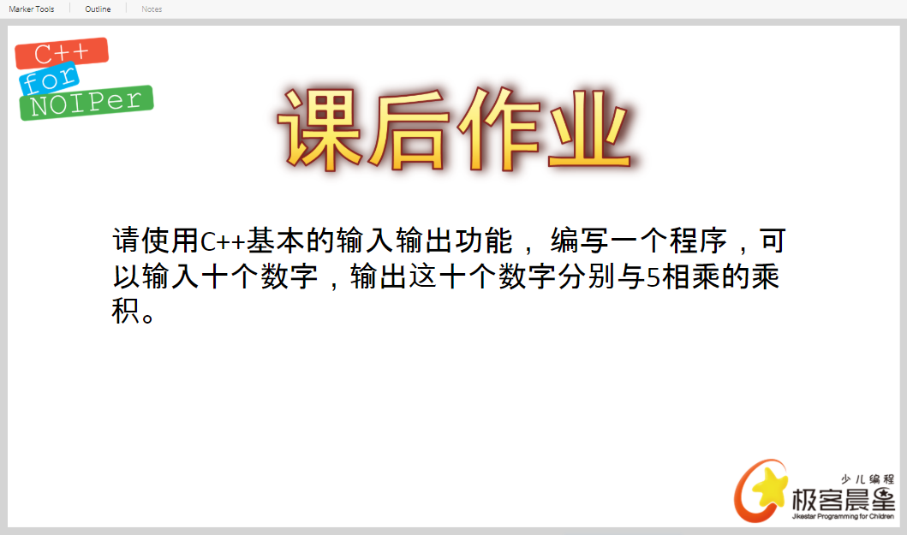

- `istream`——基本输入流

- `ostream`——基本输出流

- `cout`——是`ostream`的类对象

- `cin`——是`istream`的类对象

- `cerr `——是`ostream`的类对象 *标准错误输出流*

- `endl`——end of the line = \n *但要写到字符串中*

- `std`——standard 标准

## 写诗

```c++
# include <iostream>
using namespace std;
int main(){
    cout << "Twinkle,twinkle,little star," << endl;
    cout << "How I wonder what you are!" << endl;
    cout << "Up above the world so high," << endl;
    cout << "Like a diamond in the sky." << endl;
    return 0;
}
```

## 五叔相加

```c++
# include <iostream>
using namespace std;
int main(){
    int a, b, c, d, e;
    cin >> a >> b >> c >> d >> e;
    cout << "a + b + c + d + f = " << a+b+c+d+e;
    return 0;
}
```

## 正方形的周长和面积

```c++
# include <iostream>
using namespace std;
int main(){
    int lengthOfSide;
    cin >> lengthOfSide;
    cout << 4 * lengthOfSide << endl;
    cout << lengthOfSide * lengthOfSide << endl;
    return 0;
}
```

## 



```c++
# include <iostream>
using namespace std;
int main()
{
    int a, b, c, d, e, f, g, h, l, m;
    cin >> a >> b >> c >> d >> e >> f >> g >> h >> l >> m;
    cout << a * 5 << b * 5 << c * 5 << d * 5 << e * 5 << f * 5 << g * 5 << h * 5 << l * 5 << m * 5  << endl;
    return 0;
}
```

- `cout.put(int)`——输出与 int 对应的字符

## 大小写转换

`65-90`——大写字母

`97-122`——小写字母

97-65=32

```c++
# include <iostream>
using namespace std;
int main()
{
	char a;
	cin >> a;
	cout.put(a-32) << endl;
	return 0;
}
```

