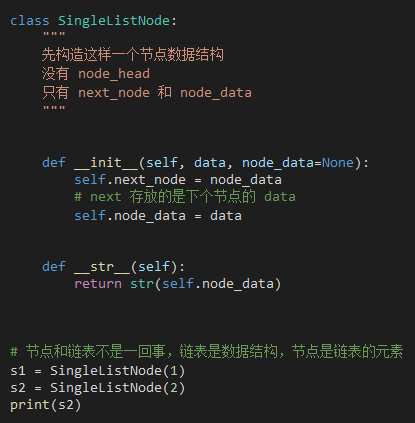

链表的难点在于指针

而 python 没有"指针"，取代的是"引用"。

将某个变量赋值给指针，实际上就是将这个变量的地址赋值给指针，或者反过来说，指针中存储了这个变量的内存地址，指向了这个变量，通过指针就能找到这个变量。

`p->next=q`——p 结点的 next 指针存储了 p 结点的下下一个结点的内存地址

`p->next=p->next->next`——p 结点的 next 指针存储了 p 结点的**下下**一个结点的内存地址。

```c
// 在数组 a 中，查找 key，返回 key 所在的位置
// 其中，n 表示数组 a 的长度
int find(char* a, int n, char key) {
  // 边界条件处理，如果 a 为空，或者 n<=0，说明数组中没有数据，就不用 while 循环比较了
  if(a == null || n <= 0) {
    return -1;
  }
  
  int i = 0;
  // 这里有两个比较操作：i<n 和 a[i]==key.
  while (i < n) {
    if (a[i] == key) {
      return i;
    }
    ++i;
  }
  
  return -1;
}

```




