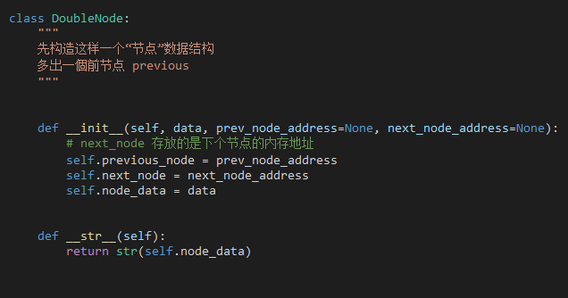
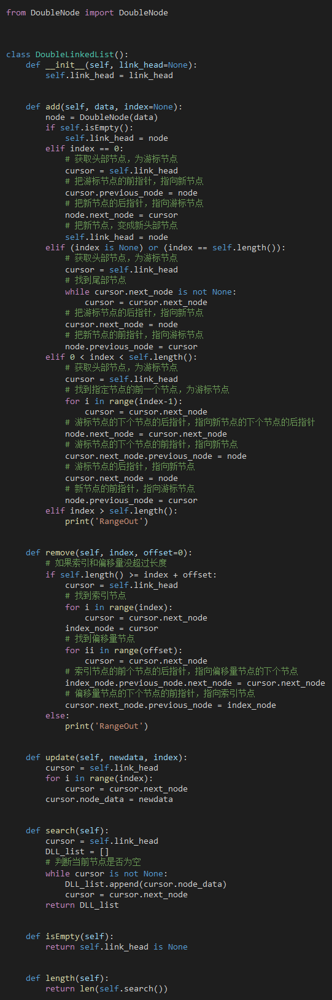

# 双向链表


```python
class DoubleNode:
    """
    先构造这样一个“节点”数据结构
    多出一個前节点 previous
    """

    def __init__(self, data, prev_node_address=None, next_node_address=None):
        # next_node 存放的是下个节点的内存地址
        self.previous_node = prev_node_address
        self.next_node = next_node_address
        self.node_data = data

    def __str__(self):
        return str(self.node_data)

```



```python
from DoubleNode import DoubleNode


class DoubleLinkedList():
    def __init__(self, link_head=None):
        self.link_head = link_head

    def add(self, data, index=None):
        node = DoubleNode(data)
        if self.isEmpty():
            self.link_head = node
        elif index == 0:
            # 获取头部节点，为游标节点
            cursor = self.link_head
            # 把游标节点的前指针，指向新节点
            cursor.previous_node = node
            # 把新节点的后指针，指向游标节点
            node.next_node = cursor
            # 把新节点，变成新头部节点
            self.link_head = node
        elif (index is None) or (index == self.length()):
            # 获取头部节点，为游标节点
            cursor = self.link_head
            # 找到尾部节点
            while cursor.next_node is not None:
                cursor = cursor.next_node
            # 把游标节点的后指针，指向新节点
            cursor.next_node = node
            # 把新节点的前指针，指向游标节点
            node.previous_node = cursor
        elif 0 < index < self.length():
            # 获取头部节点，为游标节点
            cursor = self.link_head
            # 找到指定节点的前一个节点，为游标节点
            for i in range(index-1):
                cursor = cursor.next_node
            # 游标节点的下个节点的后指针，指向新节点的下个节点的后指针
            node.next_node = cursor.next_node
            # 游标节点的下个节点的前指针，指向新节点
            cursor.next_node.previous_node = node
            # 游标节点的后指针，指向新节点
            cursor.next_node = node
            # 新节点的前指针，指向游标节点
            node.previous_node = cursor
        elif index > self.length():
            print('RangeOut')

    def remove(self, index, offset=0):
        # 如果索引和偏移量没超过长度
        if self.length() >= index + offset:
            cursor = self.link_head
            # 找到索引节点
            for i in range(index):
                cursor = cursor.next_node
            index_node = cursor
            # 找到偏移量节点
            for ii in range(offset):
                cursor = cursor.next_node
            # 索引节点的前个节点的后指针，指向偏移量节点的下个节点
            index_node.previous_node.next_node = cursor.next_node
            # 偏移量节点的下个节点的前指针，指向索引节点
            cursor.next_node.previous_node = index_node
        else:
            print('RangeOut')

    def update(self, newdata, index):
        cursor = self.link_head
        for i in range(index):
            cursor = cursor.next_node
        cursor.node_data = newdata

    def search(self):
        cursor = self.link_head
        DLL_list = []
        # 判断当前节点是否为空
        while cursor is not None:
            DLL_list.append(cursor.node_data)
            cursor = cursor.next_node
        return DLL_list

    def isEmpty(self):
        return self.link_head is None

    def length(self):
        return len(self.search())


DLL = DoubleLinkedList()
DLL.add(7)
DLL.add(8, 0)
print(DLL.search())
DLL.add(2, 2)
print(DLL.search())
DLL.add(4, 1)
print(DLL.search())
DLL.update(9, 1)
print(DLL.search())
DLL.remove(1, 1)
# DLL.add(8, 5)
print(DLL.search())
print(DLL.length())

```



