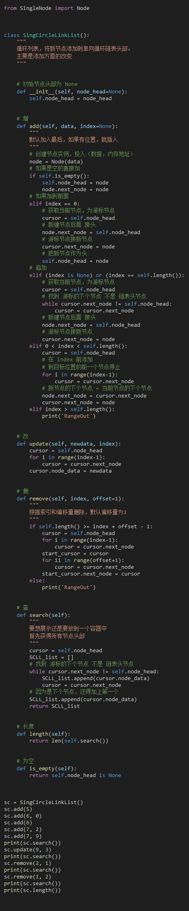

# 循环链表


```python
from SingleNode import Node


class SingCircleLinkList():
    """
    循环列表，将新节点添加到单向循环链表头部。
    主要是添加方面的改变
    """

    # 初始节点头部为 None
    def __init__(self, node_head=None):
        self.node_head = node_head

    # 增
    def add(self, data, index=None):
        """
        默认加入最后，如果有位置，就插入
        """
        # 创建节点实例，投入（数据，内存地址）
        node = Node(data)
        # 如果是空的直接加
        if self.is_empty():
            self.node_head = node
            node.next_node = node
        # 如果加到前面
        elif index == 0:
            # 获取当前节点，为游标节点
            cursor = self.node_head
            # 新建节点后面 接头
            node.next_node = self.node_head
            # 游标节点接新节点
            cursor.next_node = node
            # 把新节点作为头
            self.node_head = node
        # 追加
        elif (index is None) or (index == self.length()):
            # 获取当前节点，为游标节点
            cursor = self.node_head
            # 找到 游标的下个节点 不是 链表头节点
            while cursor.next_node != self.node_head:
                cursor = cursor.next_node
            # 新建节点后面 接头
            node.next_node = self.node_head
            # 游标节点接新节点
            cursor.next_node = node
        elif 0 < index < self.length():
            cursor = self.node_head
            # 在 index 前添加
            # 到目标位置的前一个节点停止
            for i in range(index-1):
                cursor = cursor.next_node
            # 新节点的下个节点 = 当前节点的下个节点
            node.next_node = cursor.next_node
            cursor.next_node = node
        elif index > self.length():
            print('RangeOut')

    # 改
    def update(self, newdata, index):
        cursor = self.node_head
        for i in range(index-1):
            cursor = cursor.next_node
        cursor.node_data = newdata

    # 删
    def remove(self, index, offset=1):
        """
        根据索引和偏移量删除，默认偏移量为1
        """
        if self.length() >= index + offset - 1:
            cursor = self.node_head
            for i in range(index-1):
                cursor = cursor.next_node
            start_cursor = cursor
            for ii in range(offset+1):
                cursor = cursor.next_node
            start_cursor.next_node = cursor
        else:
            print('RangeOut')

    # 查
    def search(self):
        """
        要想展示还是要放到一个容器中
        首先获得所有节点头部
        """
        cursor = self.node_head
        SCLL_list = []
        # 找到 游标的下个节点 不是 链表头节点
        while cursor.next_node != self.node_head:
            SCLL_list.append(cursor.node_data)
            cursor = cursor.next_node
        # 因为是下个节点，还得加上第一个
        SCLL_list.append(cursor.node_data)
        return SCLL_list

    # 长度
    def length(self):
        return len(self.search())

    # 为空
    def is_empty(self):
        return self.node_head is None


sc = SingCircleLinkList()
sc.add(5)
sc.add(6, 0)
sc.add(6)
sc.add(7, 2)
sc.add(7, 9)
print(sc.search())
sc.update(9, 3)
print(sc.search())
sc.remove(2, 1)
print(sc.search())
sc.remove(1, 2)
print(sc.search())
print(sc.length())

```



