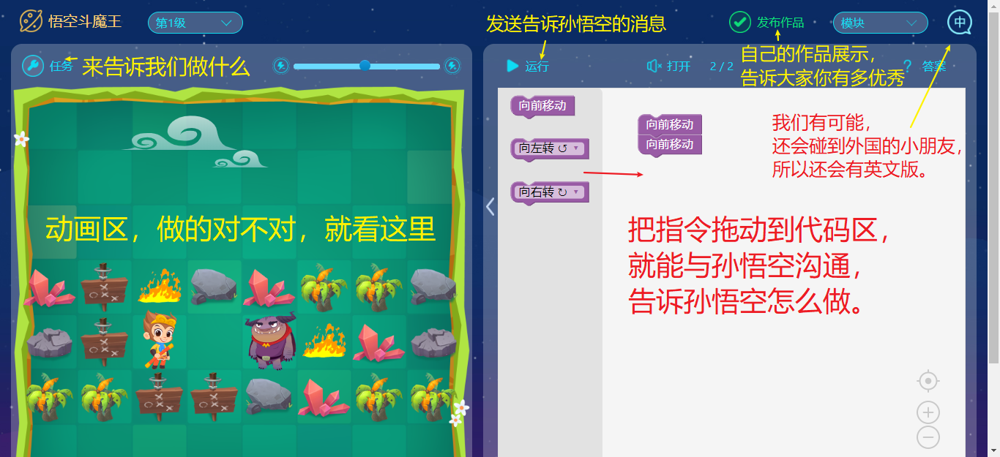
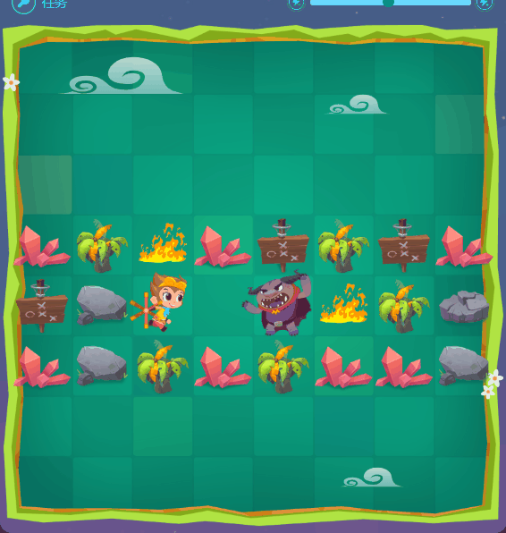
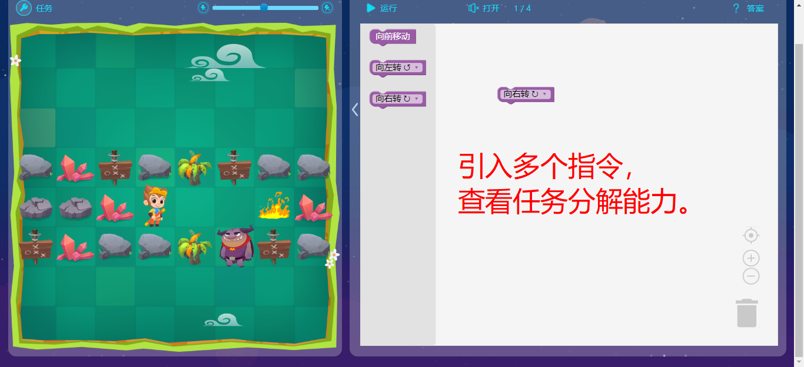
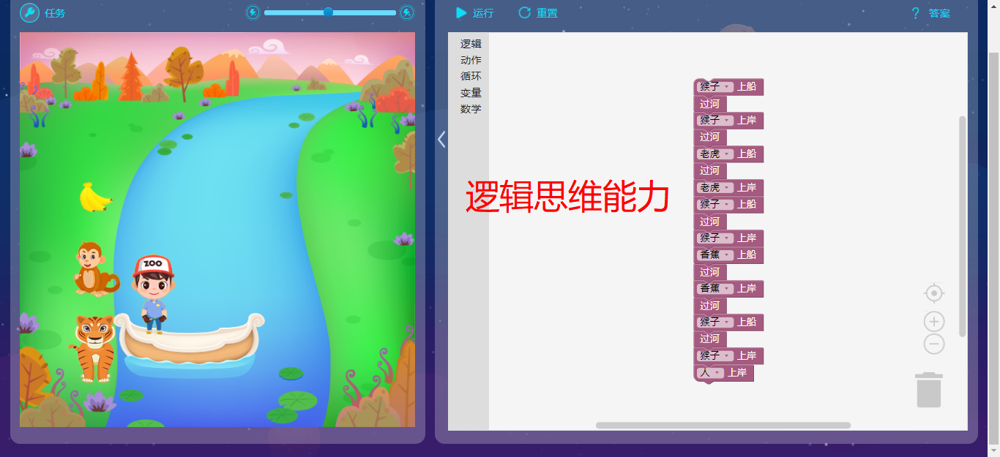
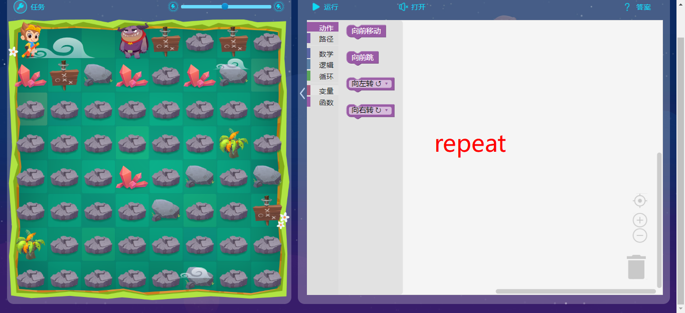

# 试听课

<ol>
    <li><a href='新内容学习'>新内容学习</a></li>
    <li><a href='练习'>练习</a></li>
</ol>

# 6-7

逻辑思维引导

## 介绍界面 2’

## 操作展示 10‘

> 指令理解能力

## 动手练习 5‘

> 模式识别能力
>
> 问题解析能力

## 多个指令 20’

> 任务分解能力

## 逻辑讲解 20‘

> 逻辑思维能力

## 循环 10’  

> 独创构思能力

# 8-10

